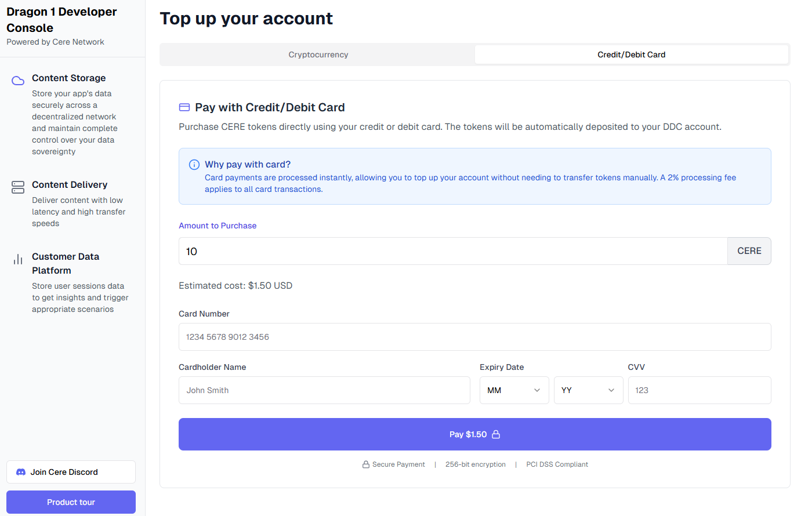
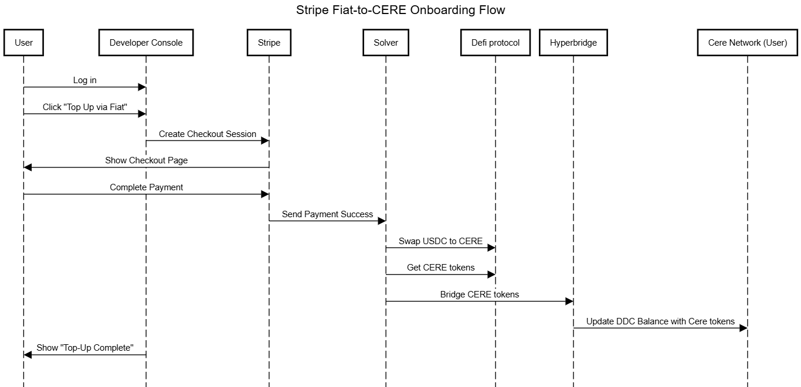

# 🚀 Developer Console Fiat & Stablecoin Onboarding  
## Submitted to Cere Foundation — [Date]  
**By:** Emmanuel Thomas

---

## 🔖 Project Identifier  
**Proposal Title:** Streamlined Fiat & Stablecoin Top-Ups for DDC  
**Slug:** `fiat-onramp-ddc`  

---

## 🧭 Abstract  
This proposal presents a comprehensive upgrade to the Cere Developer Console, allowing developers and teams to seamlessly top up their Decentralized Data Cluster (DDC) accounts using **fiat currencies (USD, EUR)** and **stablecoins (USDC, USDT)**. By integrating trusted fiat-to-crypto on-ramp providers and leveraging decentralized swap protocols, the system automates the CERE token conversion and onboarding process.  

This enhancement will significantly reduce onboarding friction, eliminate token acquisition bottlenecks, and empower developers to focus on building, not bridging tokens. The integration will also support cross-chain transfers using interoperability bridges to ensure a smooth and secure transition to the Cere Mainnet.

---

## 👥 Team Overview

### Core Members  
- **Project Lead and Blockchain Engineer:** Emmanuel Thomas
- **Frontend Developer:** Abhineet

### Contact Info  
- **Email:** emmanuel.thomas237@gmail.com
- **GitHub:** https://github.com/Stripe-Fiat-to-CERE 
- **LinkedIn:** [Your LinkedIn]  
- **Website (if any):** [URL]

---

## 🧠 Team Experience  
Our team has experience building production-ready DeFi, cross-chain, and payment infrastructure tools, including:  
- A seamless payment module for Solana
- Fiat on-ramp integrations for NFT marketplaces  
- Real-time dashboard and token swap UIs for DEX platforms on Polkadot

---

## 🛠️ Technical Scope

When a user logs into the Cere Developer Console, they are presented with an option to top up their DDC account using fiat currency. Upon clicking "Top Up via Fiat," the console triggers a backend process that creates a payment session using Stripe. The user is then redirected to a secure Stripe checkout page, where they can complete the transaction using a credit card, debit card, or other available payment options.

Once the user successfully completes the payment, Stripe notifies our backend service (referred to as the Solver) through a webhook that the transaction is complete. The Solver then initiates a swap process by interacting with a decentralized exchange like Uniswap, where it converts the received USDC into CERE tokens. After obtaining the CERE tokens, the Solver bridges them from the EVM-compatible network to the Cere Mainnet using Hyperbridge.

Once the tokens arrive on the Cere network, the user’s DDC balance is automatically updated with the newly added CERE tokens. Finally, the Developer Console reflects this change by showing the user a success message indicating that the top-up has been completed. This entire flow abstracts away the complexity of blockchain transactions, providing users with a seamless and intuitive fiat-to-CERE onboarding experience.

### 🔧 Key Functionalities

1. **Fiat-Based Top-Up**  
   Seamless fiat-to-USDC on-ramp via providers like Stripe or Transak with user KYC flow.

2. **Stablecoin Top-Up**  
   Support for stablecoin deposits (USDC/USDT on Ethereum/Polygon) with automatic backend detection.

3. **Token Conversion**  
   Smart contract integration with Uniswap or 1inch for swapping stablecoins to CERE.

4. **Cross-Chain Bridge Support**  
   Bridge CERE tokens from EVM chains to Cere Mainnet via Hyperbridge.

5. **Developer Console UI/UX Upgrade**  
   Responsive UI integration within the Developer Console to support onboarding options.

6. **Automated Account Crediting**  
   Secure DDC account balance updates upon transaction confirmation.

---

## 🎨UI Wireframe

---

## 📆 Development Timeline

Milestone | Duration | FTE | Deliverables |
|----------:|----------:|-----:|--------------|

**M1: UI/UX Implementation** | 2 weeks | 1.5 |  
- Console UI with payment module  
- Real-time balance reflection in DDC dashboard  
- Error handling and retry flows 

**M2: Core Infrastructure Setup** | 1 weeks | 1.5 |  
- Integration with Stripe/Transak API  
- Smart contracts for USDC→CERE swaps  
- Cross-chain transfer via Hyperbridge  

 **M3: Testing, Docs & Mainnet Launch** | 1 weeks | 2 |  
- Unit and integration tests on Sepolia and Cere Testnet  
- Developer and admin documentation  
- Final deployment to Cere Mainnet  

**Total Duration:** 1 Month 
**Total FTE:** 2

---

## 📈 Future Plans

- **Payment Partnerships:** Collaborate with on-ramp providers for subsidized fees.  
- **Analytics Dashboard:** Add on-chain and fiat conversion stats to track user growth.  
- **Feedback Loop:** Incorporate feedback from early users to optimize UI and flows.  
- **Multilingual Support:** Expand accessibility for international developers.

---

## 💰 Funding & Delivery Details  
**Preferred Payout Method:** USDC  
**Ethereum Address:** `0x000000...`  

---

## 🖼️ Sequence Diagram

---

## 🧩 Why This Matters

The complexity of acquiring and using CERE tokens currently deters non-technical users and slows ecosystem growth. By enabling direct fiat and stablecoin top-ups, we eliminate these entry barriers and support a more inclusive developer experience. This proposal aligns with Cere’s mission to decentralize data ownership while making onboarding as seamless as Web2 platforms.
