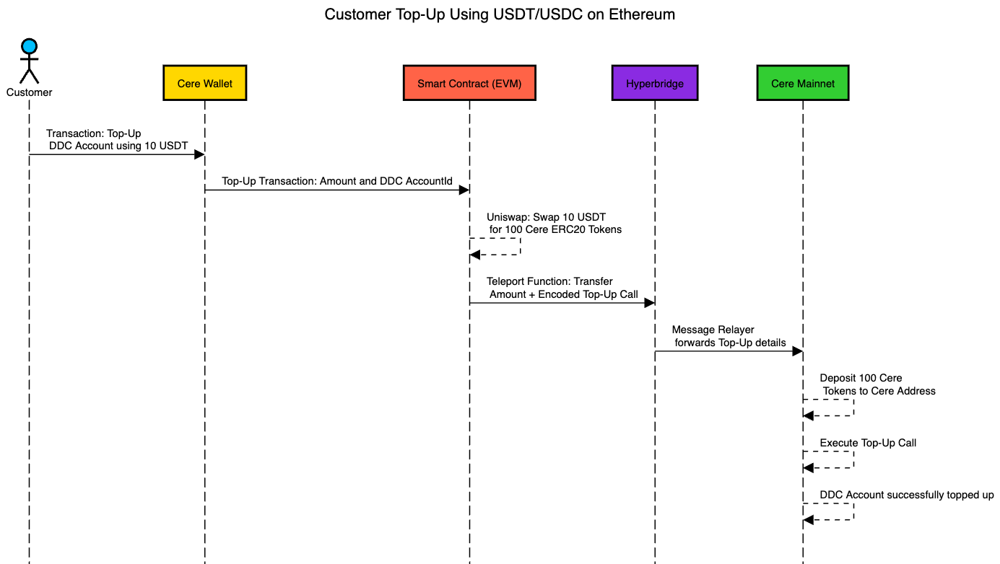
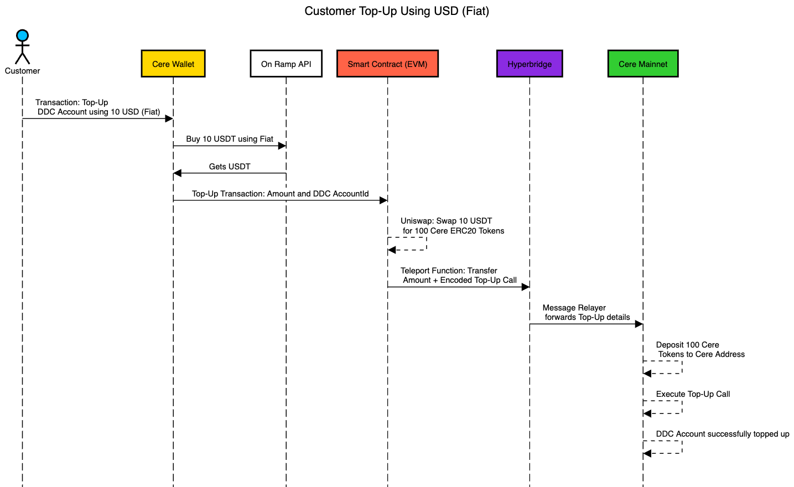

# Developer Console USDC / Fiat Onboarding Proposal
## Proposal submitted to Cere Foundation on Thursday, April 03, 2025, by Jarvis

## Project Slug
[Link to the Cere-provided idea](https://ppl-ai-file-upload.s3.amazonaws.com/web/direct-files/11827905/f080c280-706e-4c8d-adc9-e946a360a3cd/paste.txt)

## Abstract
This proposal aims to enhance the Cere Developer Console by enabling users to top up their Decentralized Data Cluster (DDC) accounts using fiat currencies (USD/EUR) or cryptocurrencies (USDC/USDT). The current system requires users to acquire CERE tokens manually, creating friction in the onboarding process. The proposed solution integrates fiat-to-crypto on-ramp services and smart contracts for automated token conversion and cross-chain functionality. This will simplify the process, improve user experience, and encourage broader adoption of the Cere ecosystem. References are linked in the **References** section below.

## Team 🧑‍🤝‍🧑

> [!IMPORTANT]  
> Please note that the data provided in this section is for administrative and informational purposes only.

### Team Members
- **Team Leader:** [Name of team leader]
- **Team Members:** [Names of team members]

### Contact
- **Contact Name:** Jarvis
- **Contact Email:** jarvis@stark_industries.com
- **Website:** NA

### Team's Experience
Our team has extensive experience in blockchain development, smart contract creation, and user interface design. Notable projects include:
1. Development of a cross-chain payment gateway integrating Ethereum and Binance Smart Chain.
2. Implementation of automated token swaps for decentralized exchanges (DEXs).

If any team member has applied for a Web3 Foundation grant previously, details are provided here: [List project names and legal entities].

### Team Code Repos
- https://github.com/{your_organisation}/{project_1}
- https://github.com/{your_organisation}/{project_2}

GitHub accounts:
- https://github.com/{team_member_1}
- https://github.com/{team_member_2}

LinkedIn profiles:
- https://www.linkedin.com/{person_1}
- https://www.linkedin.com/{person_2}

## Development Roadmap :nut_and_bolt:

### Overview
- **Total Estimated Duration:** 3 months
- **Full-Time Equivalent (FTE):** 2 FTE

### Milestone 1 — Basic Functionality Integration
- **Estimated Duration:** 1 month
- **FTE:** 1.5

| Number | Deliverable                    | Specification                                                                 |
|-------:|--------------------------------|-------------------------------------------------------------------------------|
| 1      | Fiat Onboarding API Integration | Integrate APIs like Stripe for fiat-to-USDC conversion.                       |
| 2      | Token Swap Implementation      | Develop smart contracts for USDC-to-CERE token swaps using Uniswap.           |
| 3      | Cross-Chain Teleportation      | Implement Hyperbridge for transferring CERE tokens to the Cere Mainnet.       |

### Milestone 2 — UI/UX Enhancements and Automation
- **Estimated Duration:** 1 month
- **FTE:** 1.5

| Number | Deliverable                    | Specification                                                                 |
|-------:|--------------------------------|-------------------------------------------------------------------------------|
| 1      | Developer Console UI Upgrade   | Update UI to support fiat and crypto-based top-ups with enhanced workflows.   |
| 2      | Automated Account Updates      | Automate DDC account balance updates upon successful transactions.            |
| 3      | Error Handling Mechanisms      | Implement robust error handling for failed swaps or teleportation attempts.   |

### Milestone 3 — Testing and Deployment
- **Estimated Duration:** 1 month
- **FTE:** 2

| Number | Deliverable                    | Specification                                                                 |
|-------:|--------------------------------|-------------------------------------------------------------------------------|
| 1      | System Testing                 | Conduct end-to-end testing on testnets like Goerli or Sepolia.                |
| 2      | Documentation                  | Provide comprehensive user guides, API references, and troubleshooting tips.  |
| 3      | Mainnet Deployment             | Deploy the solution on the Cere Mainnet with final optimizations.             |

## Future Plans
To ensure long-term sustainability, we plan to:
- Secure funding through partnerships with payment providers and blockchain platforms.
- Promote the project at blockchain conferences and through developer outreach programs.
- Continuously enhance features based on user feedback and emerging technologies in Web3 ecosystems.

## Preferred Method of Funds Delivery
- USDC on Eth address: `0x00000`

## Link to Logo Image (1:1) in GitHub
[Provide link here]

## Other Bio and Details or Thoughts, etc.
We believe this project will significantly lower barriers to entry for new users in the Cere ecosystem while enhancing accessibility and usability for existing users.

### **Proposed Solution** 💡
# 

The proposed solution aims to simplify and enhance the DDC account top-up process by allowing users to directly top up their accounts using fiat currencies (e.g., USD or EUR) or cryptocurrencies (e.g., USDT or USDC) on EVM-based networks. This approach removes the dependency on manual token acquisition and streamlines onboarding for users unfamiliar with blockchain systems.
#### Sequence Diagrams

#### **Key Features** ✨

1. **Fiat-Based Top-Up**:
    - Users can directly top up their DDC accounts using fiat currencies like USD through an integrated On-Ramp API.
    - The system will convert fiat to USDT/USDC and then swap it for CERE tokens.
2. **Cryptocurrency-Based Top-Up**:
    - Users can utilize cryptocurrencies such as USDT or USDC to top up their DDC accounts.
    - Smart contracts will handle the swap of USDT/USDC for CERE tokens and execute the top-up transaction.
3. **Automated Token Conversion**:
    - The solution integrates with platforms like Uniswap to facilitate automatic swapping of fiat or cryptocurrency into CERE tokens.
4. **Cross-Chain Functionality**:
    - Hyperbridge technology will enable seamless transfer of CERE tokens from EVM-based networks to the Cere Mainnet.
5. **Enhanced User Experience**:
    - The Developer Console UI will be upgraded to allow users to initiate top-up transactions in just a few clicks, ensuring a smooth and intuitive process.

#### **Benefits**

1. Simplifies onboarding by eliminating the need for manual CERE token acquisition.
2. Reduces service interruptions caused by low balances through automated processes.
3. Enhances accessibility by supporting fiat currencies and popular cryptocurrencies for top-ups.
4. Improves user experience with a streamlined and user-friendly interface.
5. Encourages broader adoption of the Cere ecosystem by lowering entry barriers for non-technical users.

This proposed solution ensures a more efficient, accessible, and user-friendly process for topping up DDC accounts, fostering broader adoption of Cere's infrastructure.

--- 

