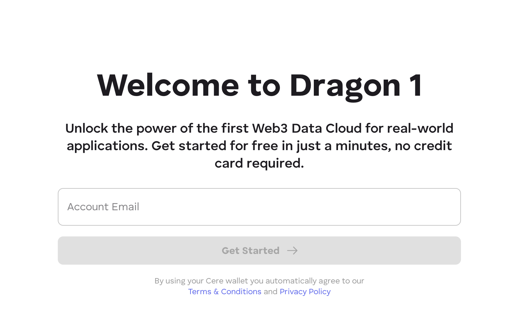
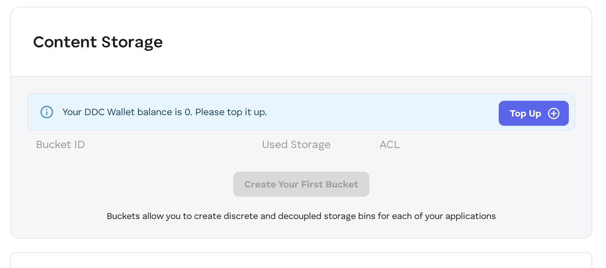
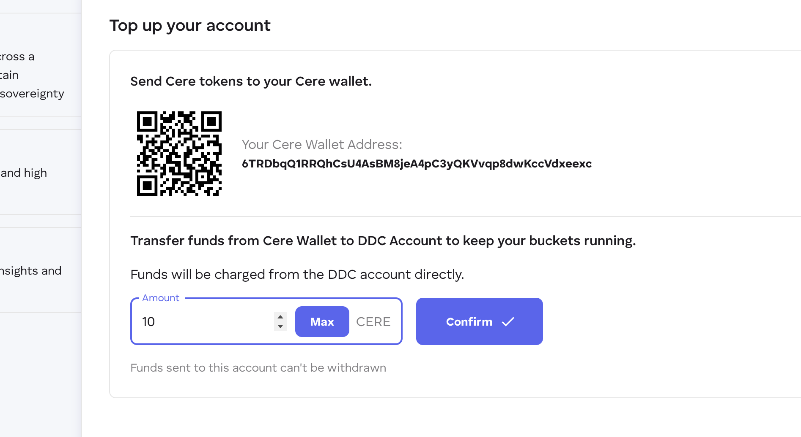
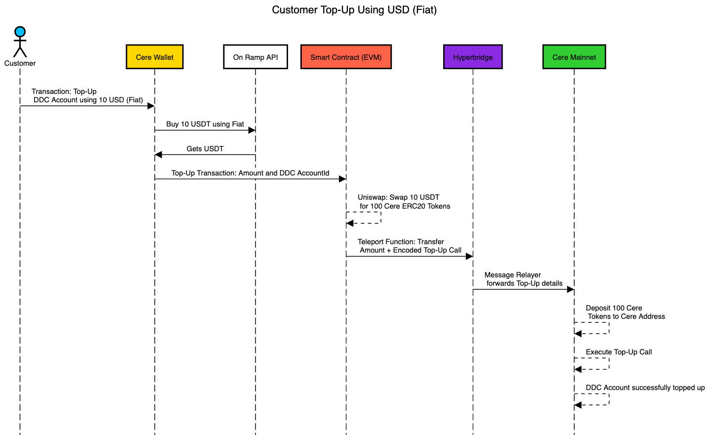

# Grant Proposal: Developer Console Top-Up System 🚀 [WIP]

Welcome to the **Developer Console Top-Up System** project! This README provides an overview of the challenges, proposed solutions, and implementation details for streamlining the top-up process for Decentralized Data Cloud (DDC) accounts. Let's dive in! 🌟

---

## 📚 Table of Contents

1. [Introduction](#-introduction)
2. [Objective](#-objective)
3. [Key Concepts/Keywords](#-key-conceptskeywords)
4. [Existing System and Challenges](#-existing-system-and-challenges)
    - [Current System Workflow](#current-system-workflow)
    - [Challenges](#challenges)
5. [Manual DDC Account Top-Up Process](#-manual-ddc-account-top-up-process)
6. [Proposed Solution](#-proposed-solution)
    - [Track 1: On-Ramp Provider & Smart Contract Integration](#track-1-on-ramp-provider--smart-contract-integration)
    - [Track 2: Substrate-Based Enhancements (WIP)](#track-2-substrate-based-enhancements-wip)
7. [Resources](#-resources)
8. [Impact and Benefits](#-impact-and-benefits)

---

## 📝 Introduction

The current manual top-up process for DDC accounts is inefficient, requiring multiple steps and creating risks of service interruptions due to delays. This project aims to **automate and simplify the process** using fiat currencies, stablecoins (USDC/USDT), and blockchain technology.

---

## 🎯 Objective

The initiative has two primary goals:

1. **Enhance the Developer Console UI** to enable direct top-ups using USD (Fiat) or USDC/USDT on EVM-based networks.
2. **Extend the DDC Customer Pallet** with an automatic top-up mechanism on the Cere Mainnet using mandates.

---

## 🔑 Key Concepts/Keywords

| **Term**              | **Definition**                                                                 |
|------------------------|-------------------------------------------------------------------------------|
| **DDC (Decentralized Data Cloud)** | A blockchain-based storage solution for decentralized applications. |
| **On-Ramp Provider**   | Service enabling fiat-to-crypto conversion.                                   |
| **Substrate**          | Framework for building blockchain systems.                                    |
| **Fiat**               | Government-issued currency like USD.                                         |
| **USDC/USDT**          | Stablecoins pegged to the value of USD.                                       |
| **Mandates**           | Automated instructions for recurring transactions.                            |

---

## ⚙️ Existing System and Challenges

### Current System Workflow

1. **Creating a DDC Account:** Customers specify account ID and top-up amount, verified by the system.
2. **Topping Up Existing Accounts:** Users manually transfer funds from their wallets to on-chain accounts.
3. **Charging for Usage:** Usage charges are deducted from customer accounts and reflected in ledgers.

### Challenges ❌
- Dependency on Cere tokens creates barriers for non-blockchain-savvy users.
- Manual top-ups increase risks of service interruptions due to low balances.

---

## 🛠️ Manual DDC Account Top-Up Process

### Steps to Manually Top-Up

1. Sign up at the Developer Console using an email ID.

2. Click the "Top Up" button to initiate a transaction.
   
3. Transfer funds manually from the Cere Wallet to the DDC Account.
   

---

## 💡 Proposed Solution

### Track 1: On-Ramp Provider & Smart Contract Integration 🌉

#### Objective
Enable direct top-ups using fiat (USD) or stablecoins (USDC/USDT), reducing manual effort and streamlining the user experience.

#### Quickstart Guide {WIP} 🚀
Steps:
1. Set up a development environment with required tools (Node.js, Solidity compiler, etc.).
2. Integrate with an On-Ramp API (e.g., Ramp Network, Transak).
3. Deploy smart contracts for token swaps and teleportation.
4. Connect to Hyperbridge for token transfers between networks.
5. Update Developer Console UI for seamless user interaction.
6. Test the end-to-end process.

#### Tasks and Features
- Fiat-to-crypto conversion via On-Ramp providers.
- Automate token swaps and teleportation using smart contracts.
- Enhance UI/UX with updated Developer Console features.

#### Milestones ⏳
1. Research & Setup: Finalize On-Ramp provider selection and develop prototypes.
2. Development: Implement fiat-to-USDT/USDC conversion and smart contracts.
3. Integration & Testing: Connect with Hyperbridge and test end-to-end functionality.
4. Deployment: Update UI and launch in production.

#### Deliverables ✅
1. A manual process enabling users to top up their accounts with fiat or crypto through an intuitive interface.
2. Programmatic automation of swaps, teleportation, and account updates via smart contracts integrated with Hyperbridge.
3. A polished UI/UX in the Developer Console that allows seamless fiat or crypto top-ups with minimal friction.
4. Documentation outlining the integration steps, workflows, and APIs used in this Track.

---

### Track 2: Substrate-Based Enhancements (WIP)

#### Objective
Develop an automated system for recurring top-ups based on mandates, ensuring uninterrupted service delivery.

#### Tasks 📋
1. Allow users to set up mandates via Cere Wallet.
2. Monitor account balances for low-level detection.
3. Automate top-ups upon low balance detection.

#### Deliverables {WIP}
- Enhanced DDC Customer Pallet supporting mandates.
- Updated Developer Console UI linked with Cere Wallet.

---

## 📖 Resources

- Cere Wallet GitHub repository
- Substrate documentation
- On-Ramp Provider API documentation

---

## 🌟 Impact and Benefits

By automating the DDC account top-up process:
1. Users enjoy a simplified experience with direct fiat or crypto options.
2. Manual efforts are reduced through automation.
3. System efficiency improves with optimized processes.
4. Service reliability increases, minimizing interruptions caused by low balances.

---

Thank you for exploring this proposal! 🚀 Let’s build a seamless future for DDC users together! 💡
